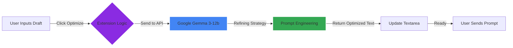

# 🚀 Prompt Optimizer

> **Transform your simple ideas into powerful, engineering-grade prompts instantly.**

**Prompt Optimizer** is a Chromium-based extension that supercharges your AI interactions. By integrating Google's **Gemma 3-12b** model directly into your browser, it turns basic queries into structured, high-context prompts that unlock the full potential of LLMs like Claude, ChatGPT, and Gemini.

---

## 🌟 Why Use Prompt Optimizer?

| Feature | Description | Benefit |
| :--- | :--- | :--- |
| **⚡ One-Click Magic** | Inject an "Optimize" button into any major AI chat interface. | No more copy-pasting to a separate tool. |
| **🧠 Powered by Gemma** | Uses the `gemma-3-12b-it` model for state-of-the-art prompt engineering. | Get professional-grade logical structuring. |
| **🔒 Privacy First** | Your API Key is stored locally in `chrome.storage`. | Your credentials never leave your browser. |
| **🎨 Native Feel** | Adopts the look and feel of the host application. | Seamless integration that feels built-in. |

---

## 🛠️ How It Works



---

## ⚡ Use Cases: Before vs. After

See the difference optimization makes:

| Scenario | ❌ Weak Prompt (Before) | ✅ Optimized Prompt (After) |
| :--- | :--- | :--- |
| **Coding** | "Fix this python code error." | "Analyze the following Python code snippet which is throwing a `TypeError`. identify the root cause, explain the fix, and provide the corrected code block with comments." |
| **Writing** | "Write an email to my boss about quitting." | "Draft a professional and respectful resignation email to a manager. Structure it to include gratitude for the opportunity, a clear statement of resignation, the effective date, and an offer to assist with the transition." |
| **Learning** | "Explain quantum physics." | "Explain the fundamental principles of quantum mechanics to a high school student. Use analogies to explain concepts like 'superposition' and 'entanglement' without heavy jargon." |

---

## 📥 Installation Guide

### Prerequisites
- **Google AI Studio API Key**: Get it for free [here](https://aistudio.google.com/).
- **Chromium Browser**: Chrome, Brave, Edge, etc.

### Steps
1.  **Download the Source**: Clone this repository.
    ```bash
    git clone https://github.com/Nezeon/Prompt-optimizer.git
    ```
2.  **Open Extensions Manager**:
    - Go to `chrome://extensions` in your browser.
    - Toggle **Developer mode** (top right corner).
3.  **Load Unpacked**:
    - Click **Load unpacked**.
    - Select the `Prompt-optimizer` folder.
4.  **Configure**:
    - Click the extension icon  in your toolbar.
    - Paste your **API Key**.
    - Click **Save**.

---

## 🌍 Supported Platforms

The extension automatically detects and injects itself into:

- [x] **Claude.ai** (Anthropic)
- [x] **ChatGPT** (OpenAI)
- [x] **Google Gemini** (Google)
- [x] **Google AI Studio**

---

## 🔧 Troubleshooting

| Issue | Possible Solution |
| :--- | :--- |
| **Button not showing** | Refresh the page. Ensure the extension is enabled. |
| **Optimization failed** | Check your API Key in the extension settings. Ensure you have internet access. |
| **Button vanishes** | The extension monitors DOM changes, but some heavy frameworks might hide it. We have auto-healing logic, so just wait a second or click the text area. |

---

**Developed with ❤️ by [Ayushmaan](https://github.com/Nezeon)**
*Open Source. Usage limited by Google AI Studio quotas.*
